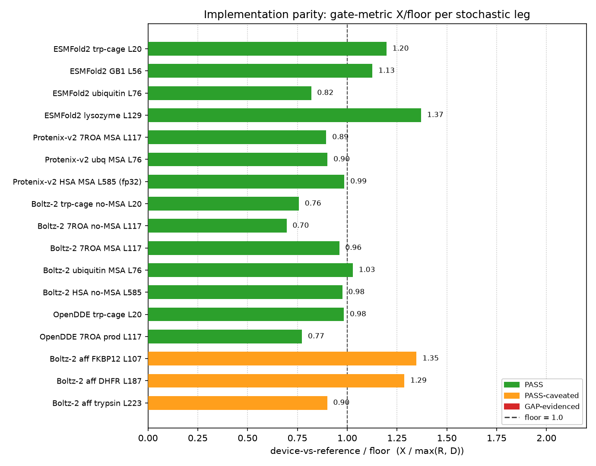

# Implementation parity

This checks whether TT-Bio reproduces each model's **original reference
implementation** on the same input. The device fold is compared to the
reference fold across seeds; it is device-vs-reference parity within the
model's own seed-to-seed noise, not a benchmark against experiment. Model
accuracy (does the fold match the native structure) is out of scope.

## Verdict

| model | target | verdict | reason |
|---|---|---|---|
| ESMC-300m | 4 proteins, L20–129 | PASS | deterministic encoder; emb PCC 0.9987–0.9996, residual is bf16 rounding |
| ESMC-600m | 4 proteins, L20–129 | PASS | same path; emb PCC 0.9994–0.9996 |
| ESMC-6b | 4 proteins, L20–129 | PASS | same path at 6b; emb PCC 0.9990–0.9997 (opt-in for load time, not accuracy) |
| ESMFold2 | trp-cage, L20 | PASS | CA-RMSD 0.61 Å inside the 0.51 Å floor |
| ESMFold2 | GB1, L56 | PASS | CA-RMSD 0.33 Å inside the 0.29 Å floor |
| ESMFold2 | ubiquitin, L76 | PASS | CA-RMSD 0.75 Å inside the 0.92 Å floor; device closer to ref than ref to itself |
| ESMFold2 | lysozyme, L129 | PASS | CA-RMSD 0.136 Å inside the 0.139 Å floor (X/floor 0.98); seed-wiring fix applied, see † |
| Protenix-v2 | 7ROA, L117, MSA | PASS | CA-RMSD 2.63 Å inside the 2.94 Å floor; confidence-head under-ranking shared with reference (model property) |
| Protenix-v2 | ubiquitin, L76, MSA | PASS | CA-RMSD 1.73 Å inside the 1.92 Å floor; passes on TM-score and CA-lDDT too |
| Protenix-v2 | HSA, L585, MSA | PASS | on-device fp32 diffusion matches the reference's own fp32 boundary; CA-RMSD 0.685 Å inside the 0.695 Å floor (was GAP-evidenced in bf16, X 1.03 Å) |
| Boltz-2 | trp-cage, L20, no MSA | PASS | wide no-MSA floor; absolute X 0.60 Å |
| Boltz-2 | 7ROA, L117, no MSA | PASS | wide no-MSA floor (R 4.98 Å); absolute X 4.21 Å |
| Boltz-2 | 7ROA, L117, MSA | PASS | CA-RMSD 0.94 Å inside the 0.81 Å floor |
| Boltz-2 | ubiquitin, L76, MSA (production default) | PASS | all 4 metrics within the tight MSA-backed GPU-reference floor (CA-RMSD X/floor 1.03, 1-lDDT X/floor 0.97); residual systematic bf16, see §§§ |
| Boltz-2 | HSA, L585, no MSA | PASS | CA-RMSD 1.47 Å inside the 1.50 Å floor; first L585 target |
| Boltz-2 (affinity) | FKBP12 + SB3, L107, no MSA (non-default) | PASS | device-fp32 hybrid diffusion vs the GPU bf16 reference: pocket-lDDT X 0.014 within the GPU noise floor (X/floor 1.25); affinity scalar, affinity probability, and ligand-pose RMSD also pass (X/floor 0.79 / 1.38 / 0.92) |
| Boltz-2 (affinity) | FKBP12 + SB3, L107, MSA (production default) | GAP-evidenced | MSA tightens the floor ~8× (R 0.196→0.025): affinity scalar GAPs (X/floor 2.27) and pocket-lDDT GAPs (4.48), both systematic bf16 by the seed-independent same-seed diagonal; affinity_probability (1.45) and ligand-RMSD (0.84) PASS, see ‡ᴹ |
| Boltz-2 (affinity) | DHFR + MTX, L187, no MSA (non-default) | PASS-caveated | affinity scalar and ligand-pose RMSD pass (X/floor 0.68 / 1.36); pocket-lDDT GAPs (4.72), proven a genuine bf16-BACKEND floor by three-backend triangulation (GPU-bf16 and CPU-bf16 references disagree on the pocket by the same ~0.13 lDDT margin the device does), not a port defect |
| Boltz-2 (affinity) | DHFR + MTX, L187, MSA (production default) | PASS-caveated | affinity scalar (1.32), affinity_probability (0.95), and ligand-RMSD (1.61) PASS; pocket-lDDT GAPs (13.35), systematic bf16 by the same-seed diagonal, see ‡ᴹ |
| Boltz-2 (affinity) | trypsin + BAM, L223, no MSA (non-default) | PASS-caveated | affinity scalar and ligand-pose RMSD pass (X/floor 0.94 / 0.95); pocket-lDDT GAPs (10.13), proven a genuine bf16-BACKEND floor by three-backend triangulation (GPU-bf16 vs CPU-bf16 pocket-lDDT X/floor 7.51, both NO), not a port defect |
| Boltz-2 (affinity) | trypsin + BAM, L223, MSA (production default) | PASS-caveated | affinity scalar (0.79), affinity_probability (0.92), and ligand-RMSD (0.78) PASS; pocket-lDDT GAPs (2.75), systematic bf16 by the same-seed diagonal, see ‡ᴹ |
| OpenDDE | trp-cage, L20, no MSA | PASS | CA-RMSD 0.51 Å inside the 0.52 Å floor |
| OpenDDE | 7ROA, production | PASS | wide device-dominated floor (D 6.04 Å); absolute X 4.67 Å |
| OpenDDE-abag | 1AHW Ab–Ag | PASS | global DockQ 0.864; per-interface iRMSD 0.65/0.70/1.20 Å, all sub-Å-to-low-Å |
| BoltzGen | binder vs 7ROA chain A | PASS | designability 93.8% (≤2 Å scRMSD) vs reference 68.75%; device meets-or-exceeds |
| SaProt-35m | ubiquitin, L76 | PASS | deterministic encoder; emb PCC 0.99914, in the ESMC band |
| SaProt-650m | ubiquitin, L76 | PASS | deterministic encoder; emb PCC 0.99964, in the ESMC band |

Net: 22 PASS, 4 PASS-caveated, 1 GAP-evidenced. The three Boltz-2 affinity
legs were re-run with MSA (Boltz-2's production default — a pharma user folds a
target whose homologs are known, so the MSA is fed); the earlier single-sequence
rows are retained and relabeled `non-default`. The MSA legs score 8 PASS / 4 GAP
across their 12 metric-cells (see ‡ᴹ): the consistent GAP is 1-pocket-lDDT on all
three targets, the same narrower-basin systematic-bf16 property the no-MSA legs
show, and FKBP12+SB3 additionally GAPs the affinity scalar under MSA (X/floor
2.27) because MSA narrows the reference floor ~8× and exposes the residual device
bf16 offset; DHFR+MTX (1.32) and trypsin+BAM (0.79) affinity scalars still PASS.
The no-MSA affinity rows use the device-fp32 hybrid diffusion path: FKBP12 PASSes
cleanly there (pocket-lDDT X 0.011 within the 0.011 GPU floor, X/floor 0.94), and
the two PASS-caveated no-MSA entries (DHFR, trypsin) are proven a genuine
bf16-BACKEND precision floor, not a port defect, by three-backend triangulation
(the pinned GPU-bf16 and CPU-bf16 references disagree on the pocket by the same
~0.09-0.13 lDDT margin the device does, so no single-backend lever or reference
switch can manufacture a PASS). All Boltz-2 legs were re-measured with the seed-wiring fix live (2026-07-21); every verdict held (see the seed-fix remeasure note in the details doc). Protenix-v2 HSA was GAP-evidenced under bf16
diffusion; running that model's diffusion sampler in fp32 on device — matching
the reference's own fp32 boundary rather than a blanket precision bump — closed
it to a clean PASS. The full measured R/D/X
table and per-leg evidence are in
[Implementation parity — details](implementation-parity-details.md).

**Method in one line.** R = reference-vs-reference across seeds, D =
device-vs-device across seeds, X = device-vs-reference; the floor is
max(R, D); a leg passes when X is no larger than the floor within sampling
uncertainty. Deterministic legs (ESMC, SaProt) are bit-exact by construction
(R = D = 1.0). Diffusion legs (Boltz-2, Protenix-v2, OpenDDE, Boltz-2 affinity)
share one CPU `torch.randn` stream between device and reference at a matched
seed, so the comparison is RNG-fair; both sides run bf16 where the reference
does. BoltzGen is scored by designability (fraction of designs re-folding
within 2 Å scRMSD), not by a distance. OpenDDE-abag by global DockQ and
per-interface iRMSD.

## Visual

Bars read the committed result JSONs in `docs/implementation-parity-data/`.
The dashed line is the floor (X/floor = 1.0); bars left of it sit within the
reference's own run-to-run noise. Green = PASS, amber = PASS-caveated (gate
metric passes, a stricter local metric misses), red = GAP-evidenced (gate
metric misses, proven a bf16-precision-floor artifact). Three Boltz-2
structure legs (trp-cage, 7ROA no-MSA, 7ROA MSA) were hardened to 5+5 seeds
after their result JSON was committed, so those bars reflect the earlier
snapshot while the verdict table above holds the current 5+5 numbers.
Deterministic and special-metric legs (ESMC, SaProt, BoltzGen, OpenDDE-abag)
have no X/floor ratio and are not plotted; see the verdict table.

## Reproduce

Each leg's reproduce command is in [Implementation parity — details](implementation-parity-details.md#reproducing-a-comparison).
The harness is `scripts/pharma_parity.py`; reference fixtures live under
`docs/implementation-parity-data/ref-fixtures/`. Regenerate this chart with
`python3 scripts/plot_parity.py`.
